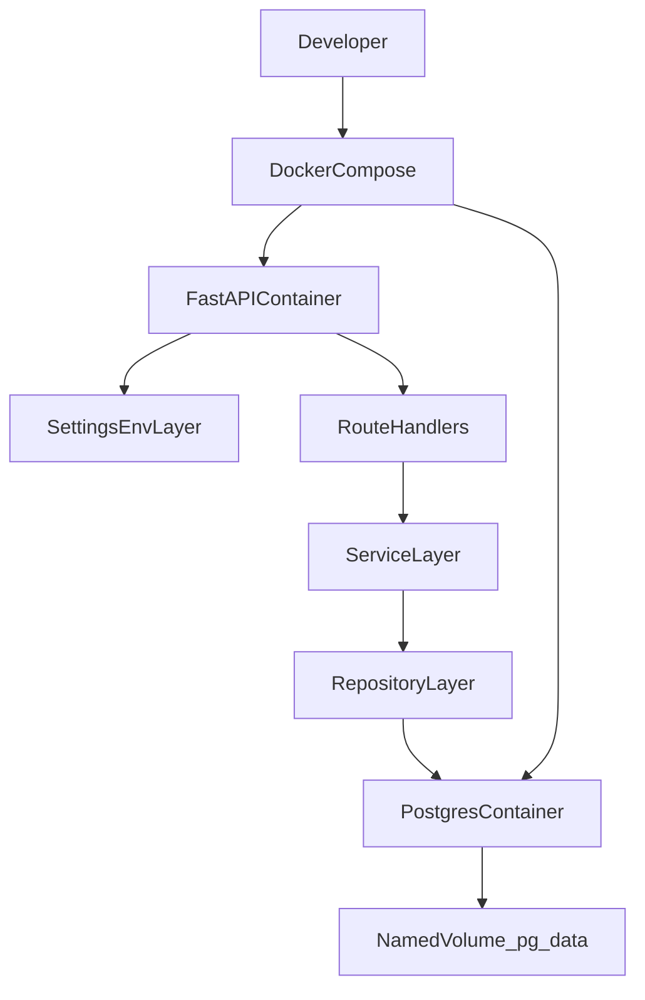

# Housing Units API

Containerized Housing Units API for New York City housing data built with Python, FastAPI, PostgreSQL, and Docker.

This README is the single source of truth for the project runbook and the interview-ready technical design.

## Executive Summary

The project is intentionally being delivered in layers:

1. establish a reproducible FastAPI baseline
2. standardize local execution with Docker Compose
3. add durable PostgreSQL persistence and migrations
4. build domain logic before widening the HTTP surface
5. expose documented API contracts through FastAPI and Swagger UI

That sequence keeps the challenge easy to review, easier to test, and easier to discuss in an interview. The current repo is at the end of Step 2: Docker, Postgres orchestration, health checks, centralized settings, and CI are in place; the application and persistence layers are still intentionally minimal.

## Current Baseline

What is implemented today:

- `docker compose up --build` starts both `api` and `db`
- the `api` container waits for the `db` health check before starting
- Postgres persists data through the named Docker volume `pg_data`
- FastAPI serves `GET /health` and automatically exposes Swagger UI at `/docs`
- configuration is centralized in `app/settings.py`
- linting and tests run through Docker and are exercised in CI

What is not implemented yet:

- SQLAlchemy models
- Alembic migration setup
- DB session layer
- `housing_units` CRUD endpoints
- NYC open-data import script
- auth enforcement on write routes
- full contract, integration, and e2e coverage

## Quickstart

```bash
cp .env.example .env
docker compose up --build
```

Then open:

- Swagger docs: `http://localhost:8000/docs`
- OpenAPI spec: `http://localhost:8000/openapi.json`
- Health check: `http://localhost:8000/health`

Startup sequence:

- `db` starts first
- Postgres becomes healthy through `pg_isready`
- `api` starts only after Postgres is healthy
- `entrypoint.sh` runs `alembic upgrade head` (idempotent — no-op if already at head)
- FastAPI binds to `0.0.0.0` and is reachable on localhost

## Why This Stack

### Python 3.12

Python 3.12 is the project baseline because it is modern, stable, and well-supported by FastAPI, SQLAlchemy, Alembic, and the Docker image ecosystem. It gives strong typing support and a good interview story without introducing version-risk or reviewer friction.

### FastAPI

FastAPI is the right app framework for this challenge because it provides:

- first-class request validation
- automatic OpenAPI generation
- Swagger UI for reviewer UX
- good typing ergonomics
- a straightforward path to clean dependency injection and auth boundaries

### PostgreSQL

PostgreSQL provides durable relational storage, predictable querying for filters, strong support for migrations, and a production-credible persistence layer. It is also a better long-term fit than a local file or in-memory approach because the challenge expects repeatable schema evolution and data persistence outside container lifecycle.

### Docker and Docker Compose

Docker is part of the design, not just packaging. It guarantees a repeatable local environment, keeps the interviewer workflow simple, and makes the eventual production discussion more concrete.

## Architecture

### Target Layering

- **API layer:** FastAPI route handlers, request parsing, response serialization
- **Service layer:** business rules, orchestration, validation beyond schema-level checks
- **Repository layer:** SQLAlchemy queries and persistence details
- **Persistence layer:** PostgreSQL schema managed through Alembic
- **Ingestion layer:** external NYC open-data client and repeatable import command

### Design Principles

- Keep route handlers thin and declarative.
- Keep business logic independent from FastAPI request/response plumbing.
- Keep data access isolated in repository modules.
- Avoid hidden coupling between endpoints.
- Prefer explicit migration and import commands over hidden startup side effects.
- Keep docs and implementation aligned in the same change set.

### Flow Diagram



## Current Repo Baseline

The current repository is deliberately still a skeleton:

- `app/main.py` exposes a minimal FastAPI app with `GET /health`
- `app/settings.py` already centralizes environment-driven config for app, DB, ingestion, and write-route auth
- `docker-compose.yml` already defines `api` and `db`, includes DB health gating, and mounts `pg_data`
- `.github/workflows/ci.yml` runs Docker-based lint and tests
- `pyproject.toml` currently holds the Ruff and pytest baseline

This matters in the interview because it shows deliberate sequencing: infrastructure and repeatability first, then schema and application behavior.

## Public vs Private Endpoints

The intended contract is:

- **Public:** `GET /housing-units`, `GET /housing-units/{id}`
- **Protected:** `POST /housing-units`, `PUT /housing-units/{id}`, `DELETE /housing-units/{id}`

### Role Model

- `viewer`: read-only
- `editor`: create and update
- `admin`: create, update, and delete

### MVP Authorization Choice

For challenge scope, API-key-based protection on write routes is the baseline:

- header: `X-API-Key`
- missing or invalid key: `401`
- error shape: `{ "code": "...", "message": "...", "details": ... }`

This keeps the app simple enough for the exercise while still showing explicit public/private boundaries. In a production discussion, the natural next step is JWT or OAuth2 with role claims.

## API Contract

### Required Endpoints

- `GET /housing-units`
- `GET /housing-units/{id}`
- `POST /housing-units`
- `PUT /housing-units/{id}`
- `DELETE /housing-units/{id}`

### `GET /housing-units` Filters

- `street_name`
- `borough`
- `postcode`
- `construction_type`
- `num_units_min`
- `num_units_max`
- `geo_shape`

For geo filtering:

- `geo_shape=rectangle` requires `min_lat`, `max_lat`, `min_lon`, `max_lon`
- `geo_shape=circle` requires `center_lat`, `center_lon`, `radius_m`

Recommended list behavior:

- predictable sorting
- limit/offset pagination
- case-insensitive string matching where appropriate
- validation that `num_units_min <= num_units_max`

Geo validation rules:

- reject mixed rectangle and circle params
- reject missing required params for the selected shape
- reject geo params provided without `geo_shape`
- return `422` with structured payload `{ code, message, details }`

### Record Semantics

- `GET /housing-units/{id}` returns one record or `404`
- `POST /housing-units` validates the body and returns `201`
- `PUT /housing-units/{id}` uses full-update semantics
- `DELETE /housing-units/{id}` returns `204`

### Source-Managed Record Rule

Imported rows with `project_id` and `building_id` are treated as source-managed:

- `PUT` on a source-managed row returns `409`
- `DELETE` on a source-managed row returns `409`

This avoids confusing overwrite and resurrection behavior during future imports.

## Data Model (Initial)

Planned initial table: `housing_units`

- `id`: internal primary key used by the API
- `project_id`: source identifier
- `building_id`: source identifier
- `street_name`
- `borough`
- `postcode`
- `construction_type`
- `num_units`: normalized from source field `total_units`
- `latitude`
- `longitude`
- `created_at`
- `updated_at`

Initial indexing strategy:

- single-column indexes on common filters
- composite uniqueness on `project_id` + `building_id`
- add composite query indexes later based on observed access patterns

## Data Source Decision

The source dataset is NYC Open Data dataset `hg8x-zxpr`.

Design choices:

- use the Socrata dataset API
- send `SODA_APP_TOKEN` outside local-only scenarios
- paginate every import
- use HTTP `POST` to `query.json` for ingestion requests
- centralize upstream access in one shared ingestion client
- normalize source data at write time before persistence
- map source `total_units` to internal/API field `num_units`

Recommended ingestion settings:

- `NYC_OPEN_DATA_URL`
- `NYC_OPEN_DATA_BASE_URL`
- `NYC_OPEN_DATA_VIEW_ID`
- `SODA_APP_TOKEN`
- `INGEST_PAGE_SIZE`
- `INGEST_TIMEOUT_SECONDS`
- `INGEST_MAX_RETRIES`

## Delivery Plan

The project is designed to be delivered in nine steps. Each step below uses the same structure so the implementation plan and interview explanation stay aligned.

### Step 1: Project Skeleton + Tooling

#### Objective

Establish a minimal, repeatable backend foundation that starts cleanly, exposes a health endpoint, centralizes configuration, and creates stable hooks for Docker, Postgres, migrations, tests, and future API work.

#### Scope

In scope:

- FastAPI app skeleton
- Python runtime selection
- core dependency baseline
- settings/config pattern
- linting and pytest baseline
- `README` runbook foundation
- minimal health endpoint

Out of scope:

- real database access
- SQLAlchemy models
- migrations
- ingestion
- CRUD endpoints
- auth enforcement beyond planning

#### Architecture / Design Decisions

- FastAPI is introduced early so the project has a real app surface and Swagger/OpenAPI from day one.
- `app/settings.py` owns environment access so future modules do not call `os.getenv()` directly.
- The first route is `GET /health` because it is the smallest useful contract for Docker health checks, CI smoke tests, and operational readiness.
- Tooling is intentionally light at the start: linting, pytest config, and app bootstrapping before domain complexity.

#### Data Model Impacts

- No DB schema is created in Step 1.
- The only data-related design decision is to reserve a dedicated settings object for the eventual `DATABASE_URL` and ingestion configuration.

#### API Impacts

- FastAPI app exists.
- Swagger UI is available immediately, even though only `/health` is implemented.
- OpenAPI becomes part of the reviewer experience from the beginning.

#### Security Considerations

- Secrets are not hardcoded; env-based configuration is established first.
- The health endpoint intentionally exposes minimal information.
- The future auth surface is planned in settings without being prematurely implemented.

#### Testing Strategy

- Add unit tests for settings parsing and app bootstrapping behavior.
- Keep the first checks fast and deterministic.
- Make linting and tests easy to run before adding DB dependencies.

#### Operational Notes

- Python 3.12 becomes the standard runtime across local development, Docker, and CI.
- App must bind to `0.0.0.0` so container networking works on localhost.
- Migration commands are not part of Step 1 and should not be hidden in app startup.

#### Risks + Mitigations

- Risk: overbuilding the app before the environment is stable.
  - Mitigation: keep Step 1 intentionally thin and measurable.
- Risk: future config drift across modules.
  - Mitigation: centralize settings from the start.
- Risk: reviewer confusion about scope.
  - Mitigation: document current baseline clearly in the README.

#### Acceptance Criteria

- app boots cleanly
- `GET /health` returns `200`
- config is env-driven
- lint/test entry points are documented
- foundation is ready for Dockerization without reworking app bootstrapping

### Step 2: Docker Environment

#### Objective

Ensure any reviewer can run the project the same way on a clean machine.

#### Scope

In scope:

- `Dockerfile`
- `docker-compose.yml`
- `api` and `db` services
- `.env.example`
- startup sequencing
- health checks

Out of scope:

- schema creation
- application CRUD logic
- import workflow

#### Architecture / Design Decisions

- Compose orchestrates the local environment instead of relying on local virtualenv setup.
- `api` and `db` run in separate containers.
- `api` depends on `db` health, not just container start.

#### Data Model Impacts

- still no app schema yet
- persistence boundary is established by introducing a real Postgres service

#### API Impacts

- `/health` becomes both a user-facing health check and a container health probe target
- Swagger UI remains reachable through the API container

#### Security Considerations

- secrets remain env-driven
- Dockerized local workflow reduces machine-specific drift
- Postgres credentials stay outside committed code

#### Testing Strategy

- verify `docker compose up --build` works from a clean clone
- verify both containers become healthy
- verify app remains reachable at `http://localhost:8000`

#### Operational Notes

- Postgres must not be considered ready until `pg_isready` passes
- the API container should start only after DB readiness
- this repo is currently at the end of this step

#### Risks + Mitigations

- Risk: app starts before DB is ready.
  - Mitigation: Compose health gating.
- Risk: reviewers need undocumented local setup.
  - Mitigation: Docker-first workflow and `.env.example`.

#### Acceptance Criteria

- `docker compose up --build` works from a clean clone
- `api` waits for `db` health before starting
- app is reachable on localhost
- Postgres runs in a separate container

### Step 3: Postgres Persistence + Migrations

#### Objective

Add durable application storage and a repeatable schema evolution path.

#### Scope

In scope:

- SQLAlchemy setup
- DB session layer
- base model setup
- first `housing_units` schema
- Alembic initialization and first migration

Out of scope:

- full CRUD implementation
- ingestion
- advanced indexing optimization

#### Architecture / Design Decisions

- use SQLAlchemy for ORM and session management
- use Alembic for explicit, versioned schema changes
- keep DB wiring in dedicated persistence modules
- keep migrations explicit rather than coupling them to FastAPI startup hooks

#### Data Model Impacts

- first real schema lands in this step
- source identity columns support future idempotent imports
- `id` is the internal API identity, not the upstream record identity

#### API Impacts

- no major endpoint expansion yet
- health checks stay lightweight; DB-aware readiness can be considered later

#### Security Considerations

- least-privileged DB credentials
- connection timeouts and clean error handling
- no leaking raw DB errors to clients

#### Testing Strategy

- migration smoke test
- repository-level tests once persistence code exists
- prove data survives container restart with the named volume

#### Operational Notes

- migration runs automatically via `entrypoint.sh` before uvicorn starts on every `docker compose up`
- Alembic's advisory lock makes concurrent starts safe; the migration is a no-op when already at head
- to run manually or inspect state:

```bash
docker compose run --rm api alembic upgrade head
docker compose run --rm api alembic current
docker compose run --rm api alembic history
```

- in production, migrations should move to a Kubernetes init container or a dedicated deploy job rather than running inside the app container; see the Migration Strategy section under Docker + Environment Design for the full trade-off discussion

#### Risks + Mitigations

- Risk: schema drift across environments.
  - Mitigation: Alembic-managed migrations and documented commands.
- Risk: hidden migration side effects on app boot.
  - Mitigation: keep migration execution explicit.

#### Acceptance Criteria

- `housing_units` schema exists
- migration scripts run cleanly
- DB session layer is in place
- data survives container restart

### Step 4: Domain + Service Layer

#### Objective

Keep business logic framework-independent and testable without HTTP.

#### Scope

In scope:

- service layer
- repository layer
- domain validation helpers
- filter composition logic

Out of scope:

- final endpoint polish
- import script implementation

#### Architecture / Design Decisions

- route handlers call services, not repositories directly
- services translate repository/client failures into domain-level exceptions
- repositories own SQLAlchemy-specific concerns

#### Data Model Impacts

- query composition starts using the `housing_units` schema
- normalization rules become part of the write path

#### API Impacts

- endpoint implementation becomes thinner and more declarative once this layer exists

#### Security Considerations

- domain layer is where source-managed row rules should be enforced
- avoid authorization logic leaking across random modules

#### Testing Strategy

- unit tests for filtering, normalization, and business rules
- mock repositories where useful to keep tests fast

#### Operational Notes

- logging and error mapping contracts should be planned alongside service boundaries

#### Risks + Mitigations

- Risk: endpoint logic grows too large.
  - Mitigation: push logic into services early.

#### Acceptance Criteria

- business logic is unit testable without an HTTP server
- repository and service responsibilities are clearly separated

### Step 5: API Endpoints + Validation + Swagger

#### Objective

Implement the required API contract with strong validation and accurate docs.

#### Scope

In scope:

- Pydantic request and response models
- route handlers
- structured error payloads
- query validation
- Swagger/OpenAPI accuracy

Out of scope:

- production-grade auth federation
- advanced observability stack

#### Architecture / Design Decisions

- request parsing belongs in FastAPI/Pydantic
- business decisions stay in services
- responses should use consistent schemas and error envelopes

#### Data Model Impacts

- request models map to normalized persistence fields
- `num_units` is the app-facing field instead of source `total_units`

#### API Impacts

- all required `/housing-units` routes become available
- filter behavior and error mapping become visible through Swagger UI

#### Security Considerations

- validate all user input
- reject malformed geo combinations with stable `422` responses
- avoid leaking stack traces or raw DB errors

#### Testing Strategy

- contract tests for status codes and schema shape
- endpoint tests for success, validation failure, not found or conflict, and auth failure where relevant

#### Operational Notes

- Swagger UI is acceptable for local reviewer UX and should mirror actual implementation

#### Risks + Mitigations

- Risk: docs drift from runtime behavior.
  - Mitigation: use FastAPI models and contract tests together.

#### Acceptance Criteria

- required endpoints work manually through curl, Postman, or Swagger
- docs accurately reflect implemented request and response contracts

### Step 6: Data Ingestion (NYC Open Data)

#### Objective

Load the upstream dataset repeatably without creating duplicates.

#### Scope

In scope:

- import command
- shared Socrata client
- field mapping
- idempotent upsert strategy

Out of scope:

- real-time sync
- background job infrastructure

#### Architecture / Design Decisions

- ingestion runs as an explicit command
- upstream access stays in one shared client module
- import logic uses source identity for idempotency

#### Data Model Impacts

- imported rows set `project_id` and `building_id`
- normalized values are written once at import time

#### API Impacts

- imported data becomes queryable through the public read endpoints

#### Security Considerations

- protect `SODA_APP_TOKEN`
- sanitize logging around upstream failures and credentials

#### Testing Strategy

- tests for mapping and normalization
- import rerun test proving no duplicate records

#### Operational Notes

- candidate command:

```bash
docker compose run --rm api python -m app.scripts.import_nyc_data
```

#### Risks + Mitigations

- Risk: upstream pagination or retry bugs create partial imports.
  - Mitigation: centralize retries, timeouts, and page-size config.

#### Acceptance Criteria

- import is repeatable
- rerunning the job does not duplicate records

### Step 7: Auth Boundaries

#### Objective

Make public reads and protected writes explicit and testable.

#### Scope

In scope:

- API-key auth for write routes
- role policy documentation
- error contract for unauthorized access

Out of scope:

- full identity provider integration

#### Architecture / Design Decisions

- keep auth as a dependency or middleware, not ad hoc checks in route bodies
- start with API key because it matches challenge scope and keeps reviewer setup simple

#### Data Model Impacts

- optional future role/user modeling can remain out of scope for MVP

#### API Impacts

- write requests without valid auth fail with `401`
- reads remain public

#### Security Considerations

- public API still needs rate limiting, validation, and clear least-privilege rules
- audit logging for write actions should be part of the production discussion

#### Testing Strategy

- auth success and failure coverage for protected routes
- source-managed-row conflict coverage for `PUT` and `DELETE`

#### Operational Notes

- auth configuration belongs in env-backed settings

#### Risks + Mitigations

- Risk: accidental public writes.
  - Mitigation: default-deny writes unless valid API key is provided.

#### Acceptance Criteria

- unauthenticated write requests are rejected correctly
- public reads remain accessible

### Step 8: Test Pyramid

#### Objective

Create confidence with fast feedback and realistic system coverage.

#### Scope

In scope:

- unit tests
- integration tests
- contract tests
- e2e or system tests

Out of scope:

- excessive coverage for low-value paths

#### Architecture / Design Decisions

- unit tests cover services, validators, and filters
- integration tests cover API plus real Postgres plus applied migrations
- e2e tests exercise the app over HTTP rather than instantiating service classes directly

#### Data Model Impacts

- tests depend on the migration-applied schema, not ad hoc table creation

#### API Impacts

- contracts become enforceable and reviewer-visible

#### Security Considerations

- protected-route auth failures and structured error payloads must be covered

#### Testing Strategy

- unit: fast, isolated business logic
- integration: API plus DB behavior
- contract: response status and schema shape
- e2e: key lifecycle flows such as migrate, import, query, mutate

#### Operational Notes

- tests should continue running through Docker to keep the environment consistent

#### Risks + Mitigations

- Risk: slow, flaky tests.
  - Mitigation: keep the pyramid layered and deterministic.

#### Acceptance Criteria

- tests are documented, reliable, and reasonably fast
- run commands are part of the README

### Step 9: Production Readiness Pass

#### Objective

Make the project easy for another engineer to run, reason about, and deploy.

#### Scope

In scope:

- health and readiness strategy
- structured logging
- CI quality gates
- dependency and image scanning considerations
- operational notes for deployment

Out of scope:

- building full platform automation inside the challenge

#### Architecture / Design Decisions

- separate local-dev convenience from production deployment behavior
- keep migrations in a deploy/init step instead of API startup events
- design for clear observability and failure diagnosis

#### Data Model Impacts

- production readiness includes backup and restore planning for Postgres

#### API Impacts

- readiness should eventually reflect downstream dependency health
- error responses should stay consistent under failure conditions

#### Security Considerations

- rate limiting for public reads
- secret management and rotation
- audit logs for writes
- security headers and CSP if a browser-facing surface expands
- supply-chain checks for dependencies and base images

#### Testing Strategy

- CI should cover lint, tests, and image build
- release validation should include migration flow and basic smoke checks

#### Operational Notes

- consider deployment targets such as Render, Railway, Fly.io, or AWS
- document environment-specific config and backup expectations
- optional future enhancement: Dependabot and AI-assisted PR review comments for maintenance velocity

#### Risks + Mitigations

- Risk: challenge solution works locally but is hard to ship.
  - Mitigation: include production-readiness notes even if full deployment is out of scope.

#### Acceptance Criteria

- another engineer can run the app and tests from documented commands
- operational expectations are explicit
- the project can be discussed credibly as something that could be hardened for production

## Docker + Environment Design

### Services

- `api`: FastAPI application container
- `db`: PostgreSQL container

### Migration Strategy

Migrations run via `entrypoint.sh`, which calls `alembic upgrade head` before handing off to uvicorn on every container start. This means `docker compose up --build` is the only command a reviewer needs — the schema is always applied before the app accepts traffic.

This is an intentional trade-off between two patterns:

**Entrypoint script (current approach)**

`entrypoint.sh` runs `alembic upgrade head` inside the `api` container before uvicorn starts. Alembic uses advisory locks so concurrent starts are safe, but the migration concern is coupled to the app container.

Chosen here because it keeps the local developer and reviewer workflow to a single command with no extra setup.

**Init container or migration job (production approach)**

In Kubernetes this is a proper `initContainer` — a short-lived container that runs migrations and exits before the app container starts. In Docker Compose it would be a dedicated `migrate` service with `restart: no` that `api` depends on via `service_completed_successfully`. This fully decouples the migration concern from the app container and is the right pattern for horizontally scaled deployments.

The rule from `AGENTS.md` is: do not couple migrations to FastAPI startup events (e.g. `@app.on_event("startup")`). An explicit entrypoint script satisfies that — it is still transparent, documented, and not hidden inside the application layer.

In a production discussion the natural next step is: move `alembic upgrade head` into a Kubernetes init container or a dedicated deploy job so the app container has no migration responsibility.

### Persistence Requirement

The database must live outside container lifecycle.

- preferred local default: named Docker volume `pg_data`
- optional alternative: bind mount if local file visibility is important

The current Compose file uses a named volume, which is the right baseline for this project because it balances durability with reviewer simplicity.

**Local-first persistence model**

Once `pg_data` exists, the named volume is the source of truth for all local development:

- `docker compose up` — volume untouched, data survives
- `docker compose up --build` — image rebuilds, volume untouched, data survives
- `docker compose down` — containers removed, volume survives
- `docker compose down -v` — volume explicitly destroyed, fresh state on next start

Alembic is idempotent: if the schema is already at head, `alembic upgrade head` is a no-op. Migrations only apply on first start or after a new migration is added.

### Environment Variables

Use:

- committed: `.env.example`
- local only: `.env`

Core variables:

- `APP_ENV`
- `APP_HOST=0.0.0.0`
- `APP_PORT=8000`
- `DATABASE_URL`
- `POSTGRES_DB`
- `POSTGRES_USER`
- `POSTGRES_PASSWORD`
- `NYC_OPEN_DATA_URL`
- `NYC_OPEN_DATA_BASE_URL`
- `NYC_OPEN_DATA_VIEW_ID`
- `SODA_APP_TOKEN`
- `INGEST_PAGE_SIZE`
- `INGEST_TIMEOUT_SECONDS`
- `INGEST_MAX_RETRIES`
- `API_AUTH_ENABLED`
- `WRITE_API_KEY`
- `WRITE_API_KEY_HEADER`
- `CORS_ALLOWED_ORIGINS`

## Local Runbook

### 1. Create local env file

```bash
cp .env.example .env
```

### 2. Start the stack

```bash
docker compose up --build
```

What this does:

- starts the `db` container
- waits for Postgres to become healthy
- starts the `api` container, which runs `alembic upgrade head` before serving traffic
- exposes FastAPI at `http://localhost:8000`

### 3. Verify the app

- Swagger docs: `http://localhost:8000/docs`
- OpenAPI spec: `http://localhost:8000/openapi.json`
- health check: `http://localhost:8000/health`

### 4. Run checks in Docker

```bash
docker compose run --rm --no-deps api ruff check .
docker compose run --rm api pytest -q
```

### 5. Run data import (Step 6)

Once Step 6 lands, populate the database with NYC open data:

```bash
docker compose run --rm api python -m app.scripts.import_nyc_data
```

Run this once. The named volume persists the data across all subsequent starts — you do not need to re-import unless you explicitly wipe the volume with `docker compose down -v`. Re-running the import is always safe: `upsert_from_source` is idempotent on `(project_id, building_id)` so no duplicate rows will be created.

### 6. Tear down

```bash
docker compose down
```

This removes the containers but keeps the Postgres volume.

### 7. Tear down and delete persisted DB data

```bash
docker compose down -v
```

This removes the containers and the named volume.

## Testing Strategy

### Unit Tests

- settings parsing
- service rules
- normalization helpers
- filter composition

### Integration Tests

- API plus real Postgres
- migration-applied schema
- CRUD and filter behavior
- error mapping and logging behavior

### Contract Tests

- status codes
- response schema
- required and optional field expectations
- structured error schema for failure paths

### E2E / System Tests

- full containerized flow over HTTP
- migrate
- import
- query
- mutate

### Test Commands

```bash
docker compose run --rm --no-deps api ruff check .
docker compose run --rm api pytest -q
docker compose run --rm api pytest tests/unit -q
docker compose run --rm api pytest tests/integration -q
docker compose run --rm api pytest tests/e2e -q
docker compose run --rm api pytest tests/contract -q
```

Current scaffolding status:

- `tests/unit/` contains active settings tests
- `tests/contract/` contains placeholder skipped tests until endpoint fixtures are wired
- `tests/integration/` now exists for real Postgres-backed tests and currently contains a skipped scaffold
- `tests/e2e/` now exists for system-level HTTP tests and currently contains a skipped scaffold

## Security and API Concerns

Even though public reads are allowed, this is still a public API and must be designed defensively.

### API Concerns

- validate all inputs
- enforce pagination bounds
- reject invalid geo parameter combinations
- keep error responses structured and stable
- avoid endpoint coupling and hidden state assumptions
- make DB failures visible but not leaky

### Security Concerns

- protect write routes
- keep secrets out of the repo
- use least-privileged DB credentials
- restrict CORS by environment
- rate limit public traffic in production
- add audit logging for writes
- avoid logging secrets or sensitive payloads
- keep dependencies and base images current

### DB Failure Handling

Waiting for the DB before app startup is necessary, but not sufficient. Runtime design must also handle later DB failures cleanly:

- clear connection error handling
- sensible DB timeouts
- stable HTTP error mapping
- logs that make DB availability issues obvious
- retries only where they are justified and bounded

## Production Readiness Considerations

The challenge can be reviewed locally, but the design should still be discussable as a production service.

- health and readiness probes
- structured logs
- CI for lint, tests, and image build
- migration step in deployment pipeline
- dependency and image vulnerability scanning
- backup and restore expectations for Postgres
- environment-specific config and secrets management
- deployment target discussion such as Render, Railway, Fly.io, or AWS

## Submission Readiness Checklist

Use this as a hard pre-submit checklist:

- `docker compose up --build` works on a clean machine
- API binds to `0.0.0.0` and is reachable on localhost
- Postgres persistence via named volume is confirmed
- required endpoints pass manual curl, Postman, or Swagger checks
- public read versus protected write behavior is explicit and tested
- `.env.example` is complete and accurate
- migration and import flow is documented and repeatable
- tests are split by unit, integration, contract, and e2e layers
- type hints and lint pass on core modules
- there is no hidden coupling between endpoints

## Interview Walkthrough

If asked to explain the design, the clearest story is:

1. start with reproducibility, not feature depth
2. use Docker Compose so the reviewer gets one consistent environment
3. keep Postgres outside app container lifecycle with a named volume
4. add Alembic before real CRUD so schema evolution is explicit
5. keep business logic out of route handlers so tests stay fast and focused
6. use FastAPI and Swagger UI to make the contract easy to inspect
7. treat public API security as real even if reads are open
8. distinguish local developer UX from production deployment concerns

That lets you talk about what is already implemented, what is planned next, and why the ordering reduces risk.

## Definition of Done

The project is ready to hand off when all of the following are true:

- required endpoints work as specified
- Swagger docs accurately reflect implementation
- Docker setup works from a clean clone
- data persists across container restarts
- migrations and import are repeatable
- public/private behavior is enforced
- tests run from documented commands
- another engineer can run and evaluate without hidden setup knowledge
